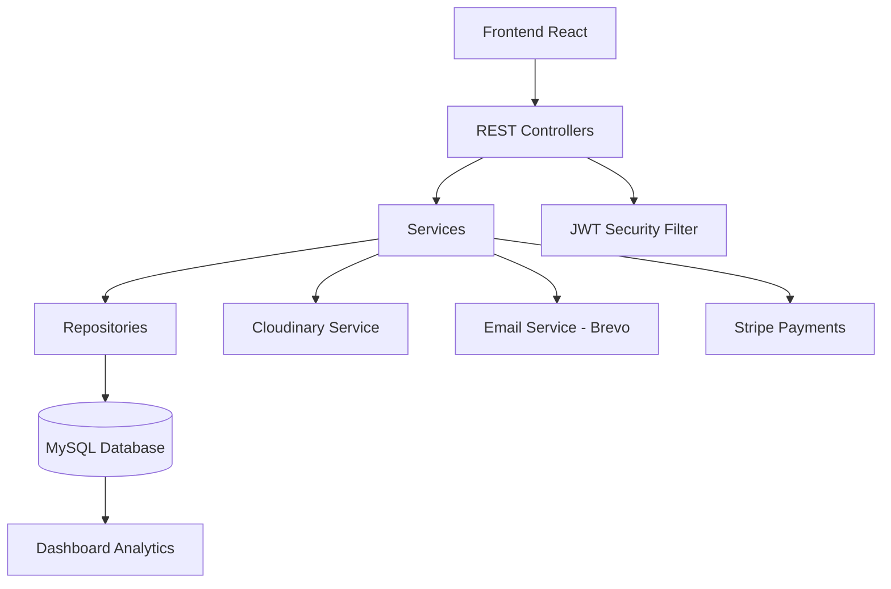
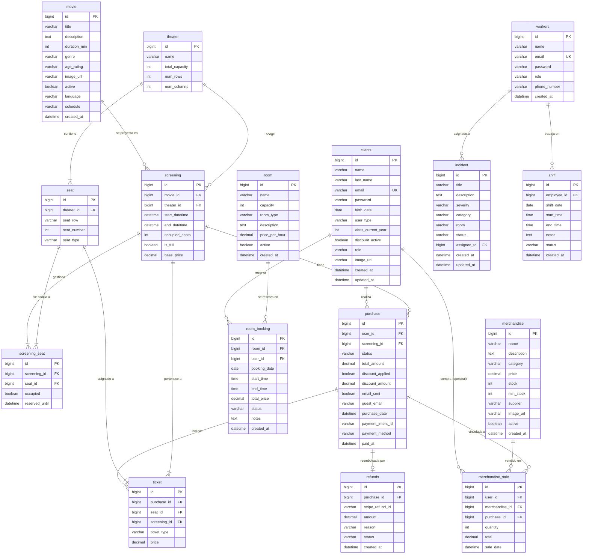
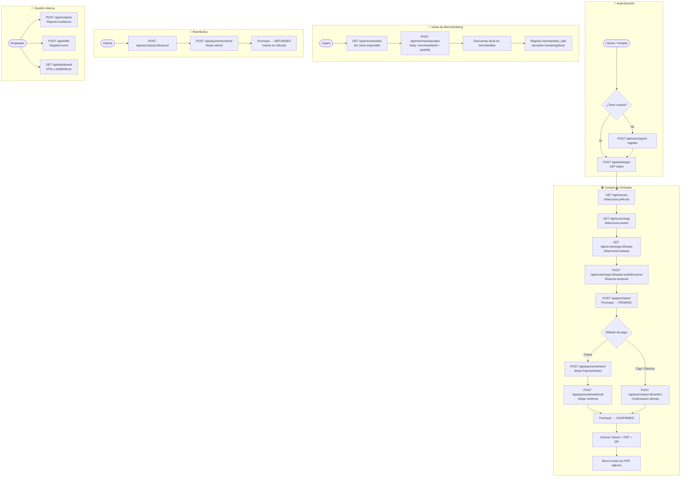
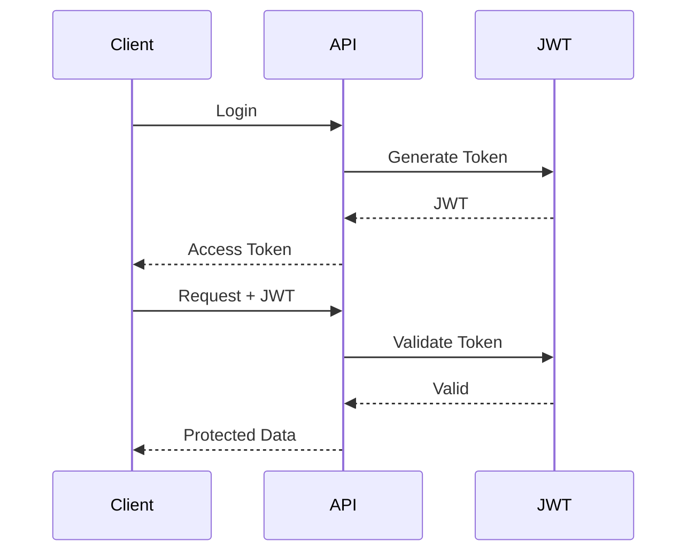

# 🎬 Lumen Cinema API

<div align="center">

## 🍿 Plataforma Backend Profesional para la Gestión Integral de Cines

API RESTful moderna construida con **Spring Boot 4** para administrar películas, salas, proyecciones, entradas, merchandising, empleados, clientes, turnos, incidencias, reservas y analíticas.


---

### 🚀 Arquitectura escalable • 🔐 Seguridad JWT • 💳 Stripe Payments • ☁️ Cloudinary • 📧 Brevo Email

</div>

---

# 📚 Tabla de Contenidos

- [✨ Características](#-características)
- [🧱 Stack Tecnológico](#-stack-tecnológico)
- [🏗️ Arquitectura del Sistema](#️-arquitectura-del-sistema)
- [🗄️ Base de Datos](#️-base-de-datos)
- [📡 Endpoints](#-endpoints)
- [🔐 Seguridad](#-seguridad)
- [💰 Sistema de Precios](#-sistema-de-precios)
- [📊 Dashboard & Reportes](#-dashboard--reportes)
- [🚀 Instalación](#-instalación)
- [⚙️ Variables de Entorno](#️-variables-de-entorno)
- [🧪 Testing](#-testing)
- [📖 Swagger](#-swagger)
- [📁 Estructura del Proyecto](#-estructura-del-proyecto)

---

# ✨ Características

## 🎥 Gestión Cinematográfica Completa

- 🎬 CRUD completo de películas con imágenes Cloudinary
- 🏢 Gestión de salas y asientos
- 🎫 Sistema avanzado de proyecciones con sincronización de asientos
- 💺 Reserva inteligente de asientos por sesión
- 🛒 Compra de entradas con flujo socio/invitado
- 👥 Gestión de clientes y empleados (con teléfono)
- 🕐 Planificación de turnos laborales
- 🚨 Gestión de incidencias
- 📊 Dashboard con estadísticas en tiempo real
- 📈 Reportes de ventas semanales y ocupación

---

## 🔥 Funcionalidades Destacadas

| Funcionalidad | Descripción |
|---|---|
| 🔐 JWT Authentication | Login seguro con roles (admin, supervisor, operador, taquilla) |
| 💳 Stripe Payments | PaymentIntents, Webhooks, Reembolsos |
| ☁️ Cloudinary Upload | Gestión de imágenes de películas y productos en la nube |
| 📧 Brevo Email | Notificación automática de compras con PDF adjunto |
| 🎟️ Multi-ticket System | CHILD / STUDENT / ADULT / SENIOR con precios diferenciales |
| 💎 Loyalty System | Descuento por fidelidad tras 10+ visitas anuales |
| 🧠 Seat Availability Engine | Control dinámico de ocupación por sesión |
| 📊 Analytics Dashboard | Métricas de ventas, top películas, ocupación |
| 🧾 PDF Generation | Tickets en PDF adjuntos al email de confirmación |
| 📄 Swagger OpenAPI | Documentación interactiva de todos los endpoints |
| 👤 Guest Purchase Flow | Compras sin registro con creación automática de usuario invitado |

---

# 🧱 Stack Tecnológico

<div align="center">

| Backend | Seguridad | Base de Datos | Dev Tools |
|---|---|---|---|
| Java 25 | JWT (jjwt 0.12.6) | MySQL 8 | Maven |
| Spring Boot 4.0.6 | Spring Security Crypto | Spring Data JPA | Lombok |
| REST API | BCrypt | Hibernate | Swagger |
| MapStruct | Auth Filters | Flyway | JUnit 5 |

</div>

## ⚙️ Tecnologías Principales

| Tecnología | Versión |
|---|---|
| ☕ Java | 25 |
| 🍃 Spring Boot | 4.0.6 |
| 🗃️ Spring Data JPA | ✅ |
| 🔐 JWT (jjwt) | 0.12.6 |
| 💳 Stripe | 24.3.0 |
| ☁️ Cloudinary | 1.39.0 |
| 📖 Swagger OpenAPI | 3.0.3 |
| 📧 Brevo SMTP | ✅ |
| 🐬 MySQL | 8.0 |
| 📦 Maven | ✅ |
| 🧩 Lombok | ✅ |
| 📄 OpenPDF | 2.0.3 |
| 📱 ZXing QR | 3.5.3 |

---

# 🏗️ Arquitectura del Sistema



---

# 🗄️ Base de Datos

## 📦 Schema General — 16 tablas

| Tabla | Entidad Java | Propósito |
|---|---|---|
| `clients` | `User` | Clientes registrados e invitados |
| `workers` | `Employee` | Empleados (cajero, gerencia, mantenimiento) |
| `movie` | `Movie` | Catálogo de películas |
| `theater` | `Theater` | Salas de cine físicas |
| `seat` | `Seat` | Butacas de cada sala |
| `screening` | `Screening` | Proyecciones (película + sala + horario) |
| `screening_seat` | `ScreeningSeat` | Estado de butaca por sesión |
| `purchase` | `Purchase` | Compras de entradas (socio o invitado) |
| `ticket` | `Ticket` | Entradas individuales vinculadas a compra |
| `refunds` | `Refund` | Reembolsos Stripe |
| `merchandise` | `Merchandise` | Productos de concesión |
| `merchandise_sale` | `MerchandiseSale` | Ventas de caja (userId opcional) |
| `room` | `Room` | Salas para eventos privados |
| `room_booking` | `RoomBooking` | Reservas de salas privadas |
| `incident` | `Incident` | Incidencias (asignadas a empleado) |
| `shift` | `Shift` | Turnos laborales de empleados |

---

## 🔗 Diagrama Entidad-Relación Completo

> Importable en draw.io: copia el bloque `erDiagram` en **Extras → Edit Diagram** de draw.io o usa la opción **Insert → Advanced → Mermaid**.



---

## 🗺️ Diagrama de Flujo del Sistema

> También importable en draw.io con **Insert → Advanced → Mermaid**.



---

# 📡 Endpoints

## 🔐 Authentication

| Método | Endpoint | Descripción |
|---|---|---|
| `POST` | `/api/auth/login` | Inicio de sesión de usuario |
| `POST` | `/api/auth/employee-login` | Inicio de sesión de empleado |

## 👤 Users

| Método | Endpoint | Descripción |
|---|---|---|
| `GET` | `/api/users` | Listar usuarios |
| `GET` | `/api/users/search?q=` | Buscar usuarios |
| `GET` | `/api/users/by-email?email=` | Buscar usuario por email |
| `GET` | `/api/users/{id}` | Obtener usuario por ID |
| `POST` | `/api/users` | Crear usuario |
| `POST` | `/api/users/quick-register` | Registro rápido para invitados |
| `PUT` | `/api/users/{id}` | Actualizar usuario |
| `DELETE` | `/api/users/{id}` | Eliminar usuario |
| `POST` | `/api/users/{id}/image` | Subir imagen de perfil |

## 👥 Clients

| Método | Endpoint | Descripción |
|---|---|---|
| `GET` | `/api/clients` | Listar clientes |
| `GET` | `/api/clients/search?q=` | Buscar clientes |
| `GET` | `/api/clients/{id}` | Obtener cliente por ID |
| `PUT` | `/api/clients/{id}` | Actualizar cliente |
| `DELETE` | `/api/clients/{id}` | Eliminar cliente |

## 👨‍💼 Employees

| Método | Endpoint | Descripción |
|---|---|---|
| `GET` | `/api/employees` | Listar empleados |
| `GET` | `/api/employees/{id}` | Obtener empleado por ID |
| `POST` | `/api/employees` | Crear empleado (con teléfono) |
| `PUT` | `/api/employees/{id}` | Actualizar empleado |
| `DELETE` | `/api/employees/{id}` | Eliminar empleado |

## 🎬 Movies

| Método | Endpoint |
|---|---|
| `GET` | `/api/movies` |
| `GET` | `/api/movies/active` |
| `GET` | `/api/movies/{id}` |
| `POST` | `/api/movies` (multipart o json) |
| `PUT` | `/api/movies/{id}` |
| `DELETE` | `/api/movies/{id}` |

## 🏛️ Theaters / Rooms

| Método | Endpoint |
|---|---|
| `GET` | `/api/theaters` |
| `GET` | `/api/theaters/{id}` |
| `GET` | `/api/theaters/{id}/seats` |
| `POST` | `/api/theaters` |
| `PUT` | `/api/theaters/{id}` |
| `DELETE` | `/api/theaters/{id}` |

## 💺 Seats

| Método | Endpoint |
|---|---|
| `GET` | `/api/seats` |
| `GET` | `/api/seats/{id}` |
| `POST` | `/api/seats` |
| `PUT` | `/api/seats/{id}` |
| `DELETE` | `/api/seats/{id}` |

## 🎫 Screenings

| Método | Endpoint | Descripción |
|---|---|---|
| `GET` | `/api/screenings` | Listar (filtro opcional `?date=`) |
| `GET` | `/api/screenings/upcoming` | Próximas sesiones |
| `GET` | `/api/screenings/{id}` | Obtener sesión |
| `GET` | `/api/screenings/movie/{movieId}` | Sesiones de una película |
| `GET` | `/api/screenings/{id}/seats` | Butacas de una sesión |
| `GET` | `/api/screenings/{id}/purchases` | Compras de una sesión |
| `POST` | `/api/screenings` | Crear sesión |
| `POST` | `/api/screenings/{id}/sync-seats` | Sincronizar butacas con la sala |
| `POST` | `/api/screenings/{id}/seats/{seatId}/reserve` | Reservar butaca |
| `POST` | `/api/screenings/{id}/seats/{seatId}/release` | Liberar butaca |
| `PUT` | `/api/screenings/{id}` | Actualizar sesión |
| `DELETE` | `/api/screenings/{id}` | Eliminar sesión |

## 🎟️ Tickets

| Método | Endpoint |
|---|---|
| `GET` | `/api/tickets` |
| `GET` | `/api/tickets/{id}` |

## 🛒 Purchases

| Método | Endpoint | Descripción |
|---|---|---|
| `POST` | `/api/purchases` | Crear compra (socio o invitado) |
| `POST` | `/api/purchases/{id}/confirm` | Confirmar y pagar compra |
| `POST` | `/api/purchases/{id}/cancel` | Cancelar compra |
| `GET` | `/api/purchases` | Listar compras |
| `GET` | `/api/purchases/{id}` | Obtener compra |
| `GET` | `/api/purchases/user/{userId}` | Compras de un usuario |
| `GET` | `/api/purchases/screening/{screeningId}` | Compras de una sesión |

## 💳 Payments (Stripe)

| Método | Endpoint | Descripción |
|---|---|---|
| `POST` | `/api/payments/intent` | Crear PaymentIntent |
| `POST` | `/api/payments/webhook` | Webhook de Stripe |
| `POST` | `/api/payments/refund` | Procesar reembolso |
| `GET` | `/api/payments/history` | Historial de pagos |

## 🕐 Shifts

| Método | Endpoint |
|---|---|
| `GET` | `/api/shifts` |
| `GET` | `/api/shifts/{id}` |
| `GET` | `/api/shifts/date/{date}` |
| `GET` | `/api/shifts/range?from=&to=` |
| `POST` | `/api/shifts` |
| `PUT` | `/api/shifts/{id}` |
| `DELETE` | `/api/shifts/{id}` |

## 🚨 Incidents

| Método | Endpoint |
|---|---|
| `GET` | `/api/incidents` |
| `GET` | `/api/incidents/{id}` |
| `POST` | `/api/incidents` |
| `PUT` | `/api/incidents/{id}` |
| `DELETE` | `/api/incidents/{id}` |

## 🍿 Merchandise

| Método | Endpoint |
|---|---|
| `GET` | `/api/merchandise` |
| `GET` | `/api/merchandise/{id}` |
| `POST` | `/api/merchandise` (multipart o json) |
| `PUT` | `/api/merchandise/{id}` |
| `POST` | `/api/merchandise/{id}/image` |
| `DELETE` | `/api/merchandise/{id}` |

## 💰 Merchandise Sales

| Método | Endpoint |
|---|---|
| `GET` | `/api/merchandisesales` |
| `GET` | `/api/merchandisesales/{id}` |
| `POST` | `/api/merchandisesales` |
| `POST` | `/api/merchandise/sales` |
| `PUT` | `/api/merchandisesales/{id}` |
| `DELETE` | `/api/merchandisesales/{id}` |

## 📊 Dashboard & Reportes

| Endpoint | Función |
|---|---|
| `GET /api/dashboard` | Dashboard global con KPIs |
| `GET /api/dashboard/yearly?year=` | Estadísticas anuales |
| `GET /api/reports/sales-week` | Ventas semanales por día |
| `GET /api/reports/occupancy` | Ocupación por película |

---

# 🔐 Seguridad

## 🛡️ Implementación JWT

El sistema utiliza autenticación basada en **JWT Tokens** con Spring Security.

### Flujo de autenticación



## 🔒 Características de Seguridad

- ✅ Password hashing con BCrypt
- ✅ Stateless authentication via JWT filter
- ✅ Roles: admin, supervisor, operator, ticket, maintenance, readonly
- ✅ Protección de endpoints por rol
- ✅ CORS configuration
- ✅ Manejo global de excepciones

---

# 💰 Sistema de Precios

## 🎟️ Política de Entradas

| Tipo | Sala Estándar | Sala VIP |
|---|---|---|
| 🧒 CHILD | 6.00 € | 9.00 € |
| 🎓 STUDENT | 6.00 € | 9.00 € |
| 🧑 ADULT | 9.00 € | 13.50 € |
| 👴 SENIOR | 2.00 € | 3.00 € |

## 📌 Reglas de Negocio

- 🧑 El ticket `ADULT` mantiene precio fijo
- 👶 Los tickets `CHILD` requieren un adulto acompañante
- 💎 Clientes con +10 visitas anuales obtienen descuento por fidelidad
- 💺 Los asientos se bloquean automáticamente tras la compra
- 👤 Los invitados pueden comprar sin registro (se crea usuario automático)
- 📧 Las compras confirmadas envían email con PDF adjunto vía Brevo

---

# 📊 Dashboard & Analytics

## 📈 Métricas Disponibles

- 🎬 Top 3 películas más vendidas
- 🛍️ Top 3 productos más vendidos
- 💰 Ingresos totales
- 🎟️ Tickets vendidos
- 📅 Reportes semanales
- 📆 Estadísticas anuales
- 🏢 Ocupación por sala

---

# 🚀 Instalación

## 1️⃣ Clonar el proyecto

```bash
git clone https://github.com/Projecto-Cine/BackendCine.git
cd BackendCine
```

## 2️⃣ Crear la base de datos

```bash
mysql -u root -p
```

```sql
CREATE DATABASE cinema;
```

## 3️⃣ Configurar variables

Editar:

```properties
src/main/resources/application.properties
```

Ver [Variables de Entorno](#️-variables-de-entorno) para la configuración necesaria.

## 4️⃣ Ejecutar aplicación

```bash
./mvnw spring-boot:run
```

## 5️⃣ Ejecutar tests

```bash
./mvnw test
```

---

# ⚙️ Variables de Entorno

```properties
# DATABASE
spring.datasource.url=jdbc:mysql://localhost:3306/cinema
spring.datasource.username=root
spring.datasource.password=your_password

# JWT
jwt.secret=your_jwt_secret_key
jwt.expiration=86400000

# CLOUDINARY
cloudinary.cloud-name=your_cloud_name
cloudinary.api-key=your_api_key
cloudinary.api-secret=your_api_secret

# STRIPE
stripe.secret-key=sk_test_your_key
stripe.publishable-key=pk_test_your_key
stripe.webhook-secret=whsec_your_secret

# EMAIL — Brevo SMTP
spring.mail.host=smtp-relay.brevo.com
spring.mail.port=587
spring.mail.username=your_brevo_username
spring.mail.password=your_brevo_smtp_key
app.mail.from=your_sender_email
```

---

# 🧪 Testing

## ✅ Cobertura del Proyecto

| Tipo de Test | Cantidad |
|---|---|
| Unit Tests | 61 clases de test |
| Service Tests | ✅ |
| Controller Tests | ✅ |
| Repository Tests | ✅ |
| Mapper Tests | ✅ |
| Security Tests | ✅ |
| Integration Tests | ✅ |

---

# 📖 Swagger

## 🌐 Documentación Interactiva

### Swagger UI

```bash
http://localhost:8080/swagger-ui.html
```

### OpenAPI Docs

```bash
http://localhost:8080/v3/api-docs
```

---

# 📁 Estructura del Proyecto

```bash
src/main/java/com/cine/demo/
│
├── config/               # Configuraciones globales (Cloudinary, CORS, Swagger)
├── controller/           # 18 REST Controllers
├── dto/
│   ├── request/          # DTOs Request
│   └── response/         # DTOs Response
├── exception/            # Manejo global de errores
├── mapper/               # MapStruct Mappers
├── model/
│   ├── converter/        # JPA Attribute Converters
│   ├── enums/            # 12 enumeraciones
│   └── ...               # 16 entidades JPA
├── repository/           # JPA Repositories
├── security/             # JWT Security + Filters
├── service/
│   └── impl/             # Implementaciones de servicios
└── util/                 # Utilidades (PriceCalculator, QRGenerator, PDFGenerator)
```

---

# 🏆 Estado del Proyecto

<div align="center">

## ✅ Producción Ready

🎬 Arquitectura escalable  
🔐 Seguridad JWT  
💳 Stripe Payments integrados  
☁️ Cloudinary Upload  
📧 Brevo Email transactional  
📊 Analytics integrados  
🧪 61 clases de test  
📖 Swagger Documentation

---

### 🍿 Lumen Cinema API

Backend profesional para ecosistemas cinematográficos modernos.

</div>
