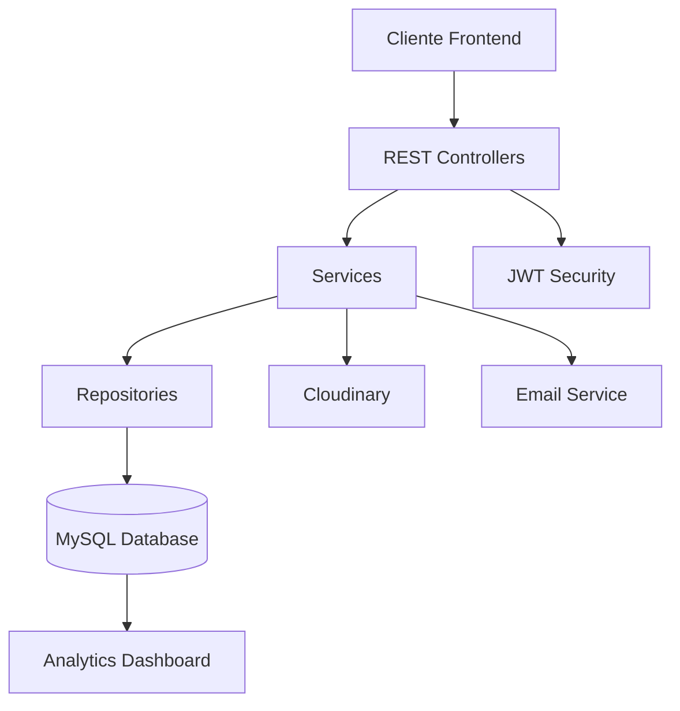
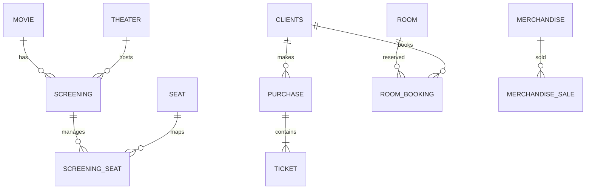
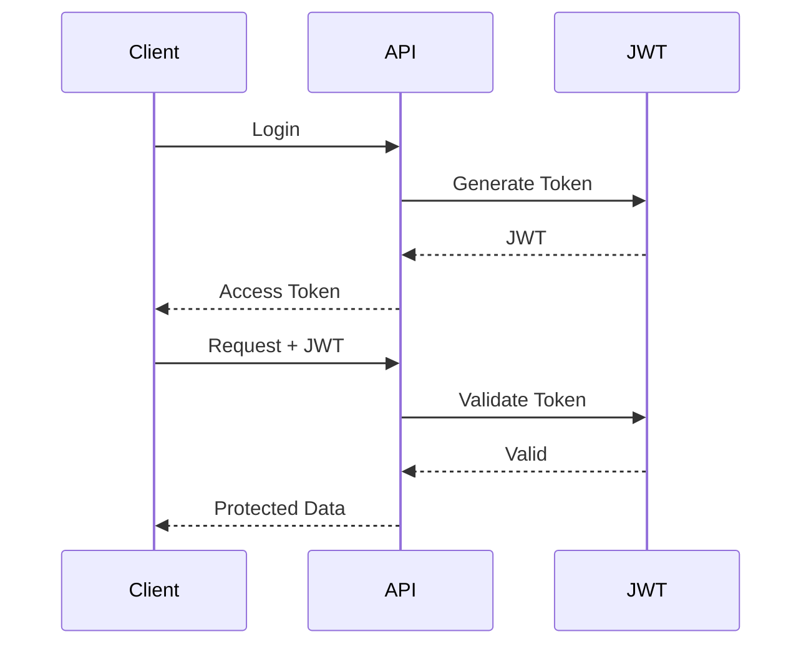

# 🎬 Lumen Cinema API

<div align="center">

## 🍿 Plataforma Backend Profesional para la Gestión Integral de Cines

API RESTful moderna construida con **Spring Boot 4** para administrar películas, salas, proyecciones, entradas, merchandising, empleados, reservas y analíticas avanzadas.


---

### 🚀 Arquitectura escalable • 🔐 Seguridad JWT • 📊 Dashboard Analytics • ☁️ Cloudinary

</div>

---

# 📚 Tabla de Contenidos

- [✨ Características](#-características)
- [🧱 Stack Tecnológico](#-stack-tecnológico)
- [🏗️ Arquitectura del Sistema](#️-arquitectura-del-sistema)
- [🗄️ Base de Datos](#️-base-de-datos)
- [📡 Endpoints](#-endpoints)
- [🔐 Seguridad](#-seguridad)
- [💰 Sistema de Precios](#-sistema-de-precios)
- [📊 Dashboard & Reportes](#-dashboard--reportes)
- [🚀 Instalación](#-instalación)
- [⚙️ Variables de Entorno](#️-variables-de-entorno)
- [🧪 Testing](#-testing)
- [📖 Swagger](#-swagger)
- [📁 Estructura del Proyecto](#-estructura-del-proyecto)

---

# ✨ Características

## 🎥 Gestión Cinematográfica Completa

- 🎬 CRUD completo de películas
- 🏢 Gestión de salas y asientos
- 🎫 Sistema avanzado de proyecciones
- 💺 Reserva inteligente de asientos
- 🛒 Compra de entradas y merchandising
- 👥 Gestión de clientes y empleados
- 🕐 Planificación de turnos laborales
- 🏠 Reserva de salas privadas
- 📊 Dashboard con estadísticas en tiempo real
- 📈 Reportes de ventas semanales y anuales

---

## 🔥 Funcionalidades Destacadas

| Funcionalidad | Descripción |
|---|---|
| 🔐 JWT Authentication | Login y registro seguro |
| ☁️ Cloudinary Upload | Gestión de imágenes en la nube |
| 📧 Email Notifications | Confirmación automática de compras |
| 🎟️ Multi-ticket System | CHILD / STUDENT / ADULT / SENIOR |
| 💎 Loyalty System | Descuento tras 10+ visitas |
| 🧠 Seat Availability Engine | Control dinámico de ocupación |
| 📊 Analytics Dashboard | Métricas de ventas y top películas |
| 🧪 264 Unit Tests | Cobertura sólida del sistema |
| 📄 Swagger OpenAPI | Documentación interactiva |

---

# 🧱 Stack Tecnológico

<div align="center">

| Backend | Seguridad | Base de Datos | Dev Tools |
|---|---|---|---|
| Java 25 | JWT | MySQL | Maven |
| Spring Boot 4.0.6 | Spring Security Crypto | Spring Data JPA | Lombok |
| REST API | BCrypt | Hibernate | Swagger |
| MapStruct | Auth Filters | SQL Schema | JUnit |

</div>

---

## ⚙️ Tecnologías Principales

| Tecnología | Versión |
|---|---|
| ☕ Java | 25 |
| 🍃 Spring Boot | 4.0.6 |
| 🗃️ Spring Data JPA | ✅ |
| 🔐 JWT (jjwt) | 0.12.6 |
| ☁️ Cloudinary | 1.39.0 |
| 📖 Swagger OpenAPI | 3.0.3 |
| 🐬 MySQL | ✅ |
| 📦 Maven | ✅ |
| 🧩 Lombok | ✅ |

---

# 🏗️ Arquitectura del Sistema



---

# 🗄️ Base de Datos

## 📦 Schema General

El sistema está compuesto por **15 tablas relacionales** organizadas para soportar:

- 🎬 Gestión de películas
- 🎫 Compra de entradas
- 💺 Disponibilidad de asientos
- 🛍️ Ventas de merchandising
- 👷 Gestión laboral
- 🏠 Reservas privadas
- 📊 Analíticas y reportes

---

## 🧩 Entidades Principales

| Entidad | Propósito |
|---|---|
| `clients` | Usuarios y clientes |
| `movie` | Catálogo de películas |
| `screening` | Proyecciones |
| `ticket` | Entradas |
| `purchase` | Compras |
| `seat` | Asientos |
| `theater` | Salas |
| `merchandise` | Productos |
| `workers` | Empleados |
| `shift` | Turnos |
| `incident` | Incidencias |

---

## 🔗 Relaciones Clave



---

# 📡 Endpoints

# 🔐 Authentication

| Método | Endpoint | Descripción |
|---|---|---|
| `POST` | `/api/auth/register` | Registro de usuario |
| `POST` | `/api/auth/login` | Inicio de sesión |

---

# 🎬 Movies

| Método | Endpoint |
|---|---|
| `GET` | `/api/movies` |
| `GET` | `/api/movies/active` |
| `GET` | `/api/movies/{id}` |
| `POST` | `/api/movies` |
| `PUT` | `/api/movies/{id}` |
| `DELETE` | `/api/movies/{id}` |

---

# 🎫 Screenings

| Método | Endpoint |
|---|---|
| `GET` | `/api/screenings` |
| `GET` | `/api/screenings/{id}` |
| `GET` | `/api/screenings/movie/{movieId}` |
| `GET` | `/api/screenings/date/{date}` |
| `POST` | `/api/screenings` |
| `PUT` | `/api/screenings/{id}` |
| `DELETE` | `/api/screenings/{id}` |
| `GET` | `/api/screenings/{id}/seats` |

---

# 🎟️ Tickets

| Método | Endpoint |
|---|---|
| `GET` | `/api/tickets` |
| `GET` | `/api/tickets/{id}` |
| `POST` | `/api/tickets` |
| `PUT` | `/api/tickets/{id}` |
| `DELETE` | `/api/tickets/{id}` |

---

# 🛒 Purchases

| Método | Endpoint |
|---|---|
| `POST` | `/api/purchases` |
| `GET` | `/api/purchases/{id}` |
| `PUT` | `/api/purchases/{id}/pay` |
| `PUT` | `/api/purchases/{id}/cancel` |
| `GET` | `/api/purchases/user/{userId}` |

---

# 📊 Dashboard & Reportes

| Endpoint | Función |
|---|---|
| `/api/dashboard` | Dashboard global |
| `/api/dashboard/yearly?year=` | Estadísticas anuales |
| `/api/reports/weekly-sales` | Ventas semanales |

---

# 🔐 Seguridad

## 🛡️ Implementación JWT

El sistema utiliza autenticación basada en **JWT Tokens** para proteger los endpoints privados.

### Flujo de autenticación



---

## 🔒 Características de Seguridad

- ✅ Password hashing con BCrypt
- ✅ Stateless authentication
- ✅ JWT validation filters
- ✅ Roles de usuario
- ✅ Protección de endpoints
- ✅ CORS configuration

---

# 💰 Sistema de Precios

## 🎟️ Política de Entradas

| Tipo | Sala Estándar | Sala VIP |
|---|:---:|:---:|
| 🧒 CHILD | 6.00 € | 9.00 € |
| 🎓 STUDENT | 6.00 € | 9.00 € |
| 🧑 ADULT | 9.00 € | 13.50 € |
| 👴 SENIOR | 2.00 € | 3.00 € |

---

## 📌 Reglas de Negocio

- 🧑 El ticket `ADULT` mantiene precio fijo
- 👶 Los tickets `CHILD` requieren un adulto acompañante
- 💎 Clientes con +10 visitas anuales obtienen descuento
- 💺 Los asientos se bloquean automáticamente tras la compra

---

# 📊 Dashboard & Analytics

## 📈 Métricas Disponibles

- 🎬 Top 3 películas más vendidas
- 🛍️ Top 3 productos más vendidos
- 💰 Ingresos totales
- 🎟️ Tickets vendidos
- 📅 Reportes semanales
- 📆 Estadísticas anuales

---

# 🚀 Instalación

## 1️⃣ Clonar el proyecto

```bash
git clone https://github.com/Projecto-Cine/BackendCine.git
cd BackendCine
```

---

## 2️⃣ Crear la base de datos

```bash
mysql -u root -p
```

```sql
CREATE DATABASE cinema;
```

---

## 3️⃣ Configurar variables

Editar:

```properties
src/main/resources/application.properties
```

---

## 4️⃣ Ejecutar aplicación

```bash
./mvnw spring-boot:run
```

---

## 5️⃣ Ejecutar tests

```bash
./mvnw test
```

---

# ⚙️ Variables de Entorno

```properties
# DATABASE
DB_URL=
DB_USERNAME=
DB_PASSWORD=

# JWT
JWT_SECRET=
JWT_EXPIRATION=

# CLOUDINARY
CLOUDINARY_CLOUD_NAME=
CLOUDINARY_API_KEY=
CLOUDINARY_API_SECRET=

# EMAIL
MAIL_USERNAME=
MAIL_PASSWORD=
```

---

# 🧪 Testing

## ✅ Cobertura del Proyecto

| Tipo de Test | Estado |
|---|---|
| Unit Tests | ✅ |
| Service Tests | ✅ |
| Controller Tests | ✅ |
| Repository Tests | ✅ |

---

## 📦 Resultado

```bash
264 TESTS PASSING
BUILD SUCCESS
```

---

# 📖 Swagger

## 🌐 Documentación Interactiva

### Swagger UI

```bash
http://localhost:8080/swagger-ui.html
```

### OpenAPI Docs

```bash
http://localhost:8080/v3/api-docs
```

---

# 📁 Estructura del Proyecto

```bash
src/main/java/com/cine/demo/
│
├── config/               # Configuraciones globales
├── controller/           # REST Controllers
├── dto/
│   ├── request/          # DTOs Request
│   └── response/         # DTOs Response
├── exception/            # Manejo global de errores
├── mapper/               # MapStruct Mappers
├── model/
│   └── enums/            # Enumeraciones
├── repository/           # JPA Repositories
├── security/             # JWT Security
├── service/
│   └── impl/             # Implementaciones
└── util/                 # Utilidades
```

---

# 🏆 Estado del Proyecto

<div align="center">

## ✅ Producción Ready

🎬 Arquitectura escalable  
🔐 Seguridad JWT  
📊 Analytics integrados  
☁️ Cloudinary Upload  
🧪 264 Tests Passing  
📖 Swagger Documentation

---

## 👥 Equipo

| Nombre | Rol | GitHub |
|--------|-----|--------|
| Javier Galvañ | Developer | [javiertunsi7](https://github.com/javiertunsi7) |
| María Regueiro | Developer | [@Mariaregue-spec](https://github.com/Mariaregue-spec) |
| Ana Morandeira | Developer | [@ana-morandeira](https://github.com/ana-morandeira) |
| Heber París | Scrum Master |[https://github.com/webermuros1-oss](https://github.com/webermuros1-oss)|
| Suso Suárez | Product Owner | [https://github.com/Suso777](https://github.com/Suso777) |

---

### 🍿 Lumen Cinema API

Backend profesional para ecosistemas cinematográficos modernos.

</div>
