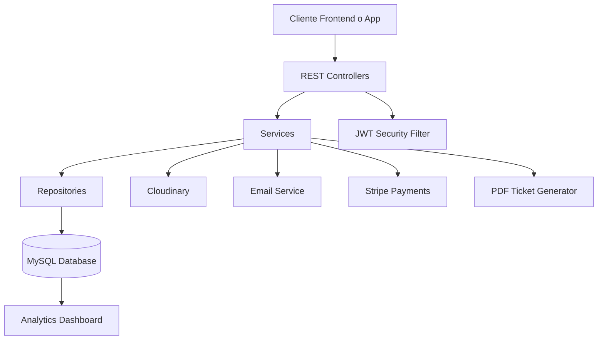
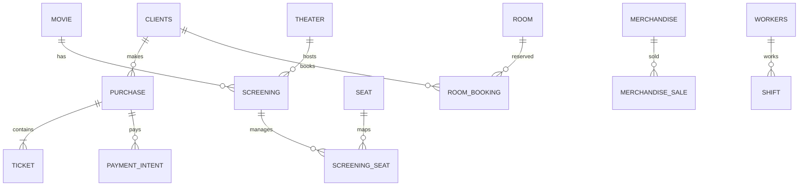
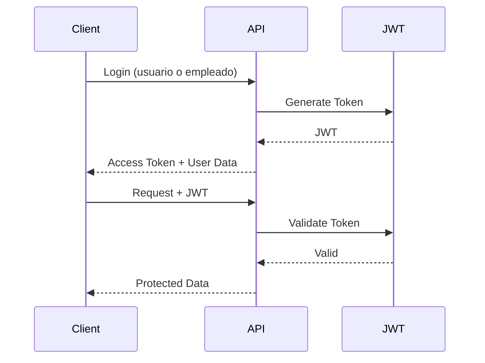
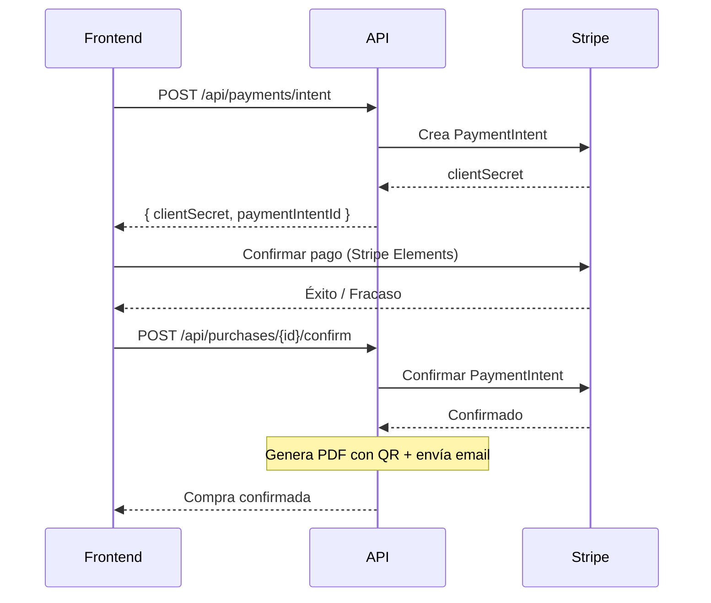

# 🎬 Lumen Cinema API

<div align="center">

## 🍿 Plataforma Backend Profesional para la Gestión Integral de Cines

API RESTful moderna construida con **Spring Boot 4** para administrar películas, salas, proyecciones, entradas, merchandising, empleados, turnos, reservas de butacas, pagos Stripe, analíticas avanzadas y más.


---

### 🚀 Arquitectura escalable • 🔐 Seguridad JWT • 💳 Stripe Payments • 📊 Dashboard Analytics • ☁️ Cloudinary • 📄 PDF con QR

</div>

---

# 📚 Tabla de Contenidos

- [✨ Características](#-características)
- [🧱 Stack Tecnológico](#-stack-tecnológico)
- [🏗️ Arquitectura del Sistema](#️-arquitectura-del-sistema)
- [🗄️ Base de Datos](#️-base-de-datos)
- [🔐 Autenticación y Roles](#-autenticación-y-roles)
- [📡 Endpoints](#-endpoints)
- [💳 Stripe Payments](#-stripe-payments)
- [🎟️ PDF Tickets con QR](#️-pdf-tickets-con-qr)
- [💺 Sistema de Reserva Temporal de Butacas](#-sistema-de-reserva-temporal-de-butacas)
- [💰 Sistema de Precios](#-sistema-de-precios)
- [📊 Dashboard & Reportes](#-dashboard--reportes)
- [🚀 Instalación](#-instalación)
- [⚙️ Variables de Entorno](#️-variables-de-entorno)
- [🧪 Testing](#-testing)
- [📖 Swagger](#-swagger)
- [📁 Estructura del Proyecto](#-estructura-del-proyecto)

---

# ✨ Características

## 🎥 Gestión Cinematográfica Completa

- 🎬 CRUD completo de películas con carteles Cloudinary
- 🏢 Gestión de salas y asientos (STANDARD / VIP)
- 🎫 Sistema avanzado de proyecciones con sincronización de butacas
- 💺 Reserva inteligente de asientos con bloqueo temporal (3 min)
- 🛒 Compra de entradas y merchandising
- 👥 Gestión de clientes y empleados
- 🕐 Planificación de turnos laborales
- 🏠 Reserva de salas privadas (data layer)
- 🚨 Sistema de incidencias con roles
- 📊 Dashboard con estadísticas en tiempo real
- 📈 Reportes de ventas semanales y ocupación

---

## 🔥 Funcionalidades Destacadas

| Funcionalidad | Descripción |
|---|---|
| 🔐 JWT Authentication | Login de usuarios y empleados |
| 💳 Stripe Payments | Payment Intents, webhooks, reembolsos |
| 📄 PDF con QR | Tickets PDF con código QR adjuntos al email |
| ⏳ Reserva Temporal | Bloqueo de butacas por 3 min con liberación automática |
| ☁️ Cloudinary Upload | Gestión de imágenes en la nube |
| 📧 Email Notifications | Confirmación de compra con PDF adjunto |
| 🎟️ Multi-ticket System | CHILD / STUDENT / ADULT / SENIOR con precios VIP |
| 💎 Loyalty System | Descuento 10% tras 10+ visitas anuales |
| 🧠 Seat Availability Engine | Control dinámico de ocupación |
| 📊 Analytics Dashboard | Métricas de ventas, top películas, ocupación |
| 👷 Employee Login | Autenticación separada para trabajadores |
| 🚨 Incident Management | CRUD con roles GERENCIA / MANTENIMIENTO |
| 🧪 264 Unit Tests | Cobertura sólida del sistema |
| 📄 Swagger OpenAPI | Documentación interactiva |
| 🌱 Data Initializer | Seed automático de datos de prueba |

---

# 🧱 Stack Tecnológico

<div align="center">

| Backend | Seguridad | Base de Datos | Dev Tools |
|---|---|---|---|
| Java 25 | JWT (jjwt 0.12.6) | MySQL | Maven |
| Spring Boot 4.0.6 | Spring Security Crypto | Spring Data JPA | Lombok |
| REST API | BCrypt | Hibernate | Swagger |
| MapStruct | Auth Filters | SQL Schema | JUnit + Mockito |

</div>

## ⚙️ Tecnologías Principales

| Tecnología | Versión |
|---|---|
| ☕ Java | 25 |
| 🍃 Spring Boot | 4.0.6 |
| 🗃️ Spring Data JPA | ✅ |
| 🔐 JWT (jjwt) | 0.12.6 |
| 💳 Stripe Java | 24.3.0 |
| ☁️ Cloudinary | 1.39.0 |
| 📖 Swagger OpenAPI | 3.0.3 |
| 📄 OpenPDF (PDF) | ✅ |
| 📱 ZXing (QR) | ✅ |
| 🐬 MySQL | ✅ |
| 📦 Maven | ✅ |
| 🧩 Lombok | ✅ |
| 🧪 JUnit 5 + Mockito | ✅ |

---

# 🏗️ Arquitectura del Sistema



## Patrones Aplicados

- **DTO pattern** — objetos separados para request y response
- **Service/Impl pattern** — interfaz + implementación
- **ApiResponse wrapper** — todas las respuestas siguen el mismo formato
- **GlobalExceptionHandler** — manejo centralizado de errores con `@RestControllerAdvice`
- **JWT stateless auth** — sin sesiones de servidor
- **ThreadLocal AuthContext** — acceso al usuario autenticado desde cualquier capa

---

# 🗄️ Base de Datos

## 📦 Schema General

El sistema está compuesto por **17 tablas relacionales** organizadas para soportar:

- 🎬 Gestión de películas
- 🎫 Compra de entradas
- 💺 Disponibilidad de asientos
- 🛍️ Ventas de merchandising y concesiones
- 👷 Gestión laboral
- 🏠 Reservas privadas (Room + RoomBooking)
- 📊 Analíticas y reportes
- 💳 Pagos Stripe y reembolsos

---

## 🧩 Entidades Principales

| Entidad | Propósito |
|---|---|
| `clients` | Usuarios y clientes con fidelización |
| `movie` | Catálogo de películas con age rating |
| `screening` | Proyecciones con precio base |
| `screening_seat` | Estado de butaca por proyección |
| `ticket` | Entradas con tipo y precio |
| `purchase` | Compras con guest email |
| `seat` | Asientos STANDARD / VIP |
| `theater` | Salas |
| `merchandise` | Productos con stock e imagen |
| `merchandise_sale` | Ventas de productos |
| `workers` | Empleados con rol y contraseña |
| `shift` | Turnos laborales |
| `incident` | Incidencias |
| `room` | Salas privadas |
| `room_booking` | Reservas de salas privadas |
| `payment_intent` | Intenciones de pago Stripe |
| `refund` | Reembolsos |

---

## 🔗 Relaciones Clave



---

# 🔐 Autenticación y Roles

## 🛡️ Implementación JWT

El sistema utiliza autenticación **stateless basada en JWT** con dos flujos de login diferenciados.

### Flujo de autenticación



### Rutas Públicas (no requieren token)

- `POST /api/auth/login` — Login de clientes
- `POST /api/auth/employee-login` — Login de empleados
- `POST /api/payments/webhook` — Webhook de Stripe

### Roles del Sistema

#### Usuarios (tabla `clients`)

| Rol | Acceso |
|---|---|
| `ADMIN` | Administrador total |
| `SUPERVISOR` | Supervisión general |
| `OPERATOR` | Operador |
| `TICKET` | Taquillero |
| `MAINTENANCE` | Mantenimiento |
| `READONLY` | Solo lectura |
| `CLIENT` | Cliente externo |

#### Empleados (tabla `workers`)

| Rol | Display Name | Acceso |
|---|---|---|
| `CASHIER` | CAJERO | Taquilla y caja |
| `MANAGEMENT` | GERENCIA | Dashboard, informes, gestión completa |
| `CLEANING` | LIMPIEZA | Turnos |
| `MAINTENANCE` | MANTENIMIENTO | Incidencias, turnos |

### 🔒 Características de Seguridad

- ✅ Password hashing con BCrypt (migración automática desde texto plano)
- ✅ Stateless authentication
- ✅ JWT validation filter con whitelist de rutas públicas
- ✅ Roles de usuario y empleado
- ✅ Protección de endpoints por ruta y `@PreAuthorize`
- ✅ CORS configuration
- ✅ AuthContext thread-local

---

# 💰 Sistema de Precios

## 🎟️ Política de Entradas

| Tipo | Sala Estándar | Sala VIP |
|---|---|---|
| 🧒 CHILD | 6.00 € | 9.00 € |
| 🎓 STUDENT | 6.00 € | 9.00 € |
| 🧑 ADULT | 9.00 € | 13.50 € |
| 👴 SENIOR | 2.00 € | 3.00 € |

Los precios VIP aplican un multiplicador de **×1.5** sobre el precio base. Cada proyección tiene su propio `basePrice`.

## 📌 Reglas de Negocio

- 🧑 El ticket `ADULT` mantiene precio fijo
- 👶 Los tickets `CHILD` requieren un adulto acompañante en la misma compra
- 💎 Clientes con **+10 visitas anuales** obtienen **10% de descuento**
- 💺 Los asientos se bloquean temporalmente durante 3 minutos al iniciar compra
- ⏳ Si no se confirma la compra en 3 min, las butacas se liberan automáticamente
- 🔞 Validación de edad contra `ageRating` de la película

---

# 💳 Stripe Payments

## Sistema Completo de Pagos

El backend integra Stripe para procesar pagos con tarjeta de forma segura.

### Flujo de Pago



### Endpoints de Pago

| Método | Endpoint | Descripción |
|---|---|---|
| `POST` | `/api/payments/intent` | Crear PaymentIntent |
| `POST` | `/api/payments/create-intent` | Crear PaymentIntent (alternativo) |
| `POST` | `/api/payments/webhook` | Webhook de Stripe (público) |
| `POST` | `/api/payments/refund` | Procesar reembolso |
| `GET` | `/api/payments/history` | Historial de pagos (filtros: from, to, status) |

---

# 🎟️ PDF Tickets con QR

## Generación Automática de Tickets

Al confirmar una compra, el sistema genera automáticamente un **PDF** con los tickets que incluye:

- 📄 Código QR único por ticket con formato: `LUMEN-CINEMA|PURCHASE:X|TICKET:Y|SEAT:...|MOVIE:...|DATE:...`
- 🎬 Nombre de la película, sala, fecha y hora
- 💺 Fila y número de butaca
- 🏷️ Tipo de entrada y precio
- 🖨️ Diseño profesional con OpenPDF

El PDF se adjunta automáticamente al email de confirmación enviado al cliente.

---

# 💺 Sistema de Reserva Temporal de Butacas

## ⏳ Bloqueo Inteligente de 3 Minutos

Durante el proceso de compra, las butacas seleccionadas se bloquean temporalmente:

1. 🔒 `tempReserveSeat()` — Bloquea la butaca con `reservedUntil = now + 3 min`
2. ✅ `confirmSeat()` — Confirma la ocupación permanente al completar la compra
3. 🔓 `releaseSeat()` — Libera la butaca si se cancela la compra
4. ⏰ **Scheduler automático** — Cada 60 segundos libera las reservas expiradas

### Métodos de verificación

| Método | Descripción |
|---|---|
| `isEffectivelyTaken()` | Comprueba si la butaca está ocupada o temporalmente reservada |
| `tempReserveSeat(screeningId, seatId)` | Reserva con timeout de 3 min |
| `confirmSeat(screeningId, seatId)` | Confirma ocupación permanente |

---

# 🚀 Instalación

## 1️⃣ Clonar el proyecto

```bash
git clone https://github.com/Projecto-Cine/BackendCine.git
cd BackendCine
```

---

## 2️⃣ Crear la base de datos

```bash
mysql -u root -p
```

```sql
CREATE DATABASE cinema;
```

---

## 3️⃣ Configurar variables

Editar:

```properties
src/main/resources/application.properties
```

---

## 4️⃣ Ejecutar aplicación

```bash
./mvnw spring-boot:run
```

> Al arrancar, el `DataInitializer` siembra automáticamente datos de prueba (usuarios, empleados, películas).

---

## 5️⃣ Ejecutar tests

```bash
./mvnw test
```

---

# ⚙️ Variables de Entorno

```properties
# DATABASE
DB_URL=
DB_USERNAME=
DB_PASSWORD=

# JWT
JWT_SECRET=
JWT_EXPIRATION=

# CLOUDINARY
CLOUDINARY_CLOUD_NAME=
CLOUDINARY_API_KEY=
CLOUDINARY_API_SECRET=

# EMAIL (Gmail SMTP)
MAIL_USERNAME=equipo2lumencinema@gmail.com
MAIL_PASSWORD=

# STRIPE
STRIPE_SECRET_KEY=
STRIPE_WEBHOOK_SECRET=
```

---

# 📡 Endpoints

## 🔐 Auth — `/api/auth`

| Método | Endpoint | Descripción | Auth |
|---|---|---|---|
| `POST` | `/login` | Inicio sesión clientes | No |
| `POST` | `/employee-login` | Inicio sesión empleados | No |

---

## 🎬 Movies — `/api/movies`

| Método | Endpoint | Descripción |
|---|---|---|
| `GET` | `/api/movies` | Listar todas |
| `GET` | `/api/movies/active` | Solo en cartelera |
| `GET` | `/api/movies/{id}` | Por ID |
| `POST` | `/api/movies` | Crear (JSON o multipart con imagen) |
| `PUT` | `/api/movies/{id}` | Actualizar |
| `DELETE` | `/api/movies/{id}` | Eliminar |

---

## 🎫 Screenings — `/api/screenings`

| Método | Endpoint | Descripción |
|---|---|---|
| `GET` | `/api/screenings` | Listar (filtro `?date=`) |
| `GET` | `/api/screenings/upcoming` | Próximas proyecciones |
| `GET` | `/api/screenings/{id}` | Por ID |
| `GET` | `/api/screenings/movie/{movieId}` | Por película |
| `GET` | `/api/screenings/{id}/seats` | Mapa de butacas |
| `GET` | `/api/screenings/{id}/purchases` | Compras de la sesión |
| `POST` | `/api/screenings` | Crear |
| `PUT` | `/api/screenings/{id}` | Actualizar |
| `DELETE` | `/api/screenings/{id}` | Eliminar |
| `POST` | `/api/screenings/{id}/sync-seats` | Sincronizar butacas con sala |
| `POST` | `/api/screenings/{id}/seats/{seatId}/reserve` | Reservar butaca |
| `POST` | `/api/screenings/{id}/seats/{seatId}/release` | Liberar butaca |

---

## 🎟️ Tickets — `/api/tickets`

| Método | Endpoint | Descripción |
|---|---|---|
| `GET` | `/api/tickets` | Listar (filtros `?purchaseId=&screeningId=`) |
| `GET` | `/api/tickets/{id}` | Por ID |

---

## 🛒 Purchases — `/api/purchases`

| Método | Endpoint | Descripción |
|---|---|---|
| `GET` | `/api/purchases` | Listar todas |
| `GET` | `/api/purchases/{id}` | Por ID |
| `GET` | `/api/purchases/user/{userId}` | Por usuario |
| `GET` | `/api/purchases/screening/{screeningId}` | Por proyección |
| `POST` | `/api/purchases` | Crear (soporta `guestEmail`) |
| `POST` | `/api/purchases/{id}/confirm` | Confirmar pago |
| `POST` | `/api/purchases/{id}/cancel` | Cancelar |

---

## 👥 Users — `/api/users`

| Método | Endpoint | Descripción |
|---|---|---|
| `GET` | `/api/users` | Listar todos |
| `GET` | `/api/users/search?q=` | Buscar |
| `GET` | `/api/users/by-email?email=` | Por email |
| `GET` | `/api/users/{id}` | Por ID |
| `POST` | `/api/users` | Crear |
| `POST` | `/api/users/quick-register` | Registro rápido |
| `PUT` | `/api/users/{id}` | Actualizar |
| `DELETE` | `/api/users/{id}` | Eliminar |
| `POST` | `/api/users/{id}/image` | Subir foto perfil |

---

## 👤 Clients — `/api/clients`

| Método | Endpoint | Descripción |
|---|---|---|
| `GET` | `/api/clients` | Listar clientes |
| `GET` | `/api/clients/search?q=` | Buscar |
| `GET` | `/api/clients/{id}` | Por ID |
| `PUT` | `/api/clients/{id}` | Actualizar |
| `DELETE` | `/api/clients/{id}` | Eliminar |

---

## 👷 Employees — `/api/employees`

| Método | Endpoint | Descripción |
|---|---|---|
| `GET` | `/api/employees` | Listar |
| `GET` | `/api/employees/{id}` | Por ID |
| `POST` | `/api/employees` | Crear |
| `PUT` | `/api/employees/{id}` | Actualizar |
| `DELETE` | `/api/employees/{id}` | Eliminar |

---

## 🕐 Shifts — `/api/shifts`

| Método | Endpoint | Descripción |
|---|---|---|
| `GET` | `/api/shifts` | Listar |
| `GET` | `/api/shifts/{id}` | Por ID |
| `GET` | `/api/shifts/date/{date}` | Por fecha |
| `GET` | `/api/shifts/range?from=&to=` | Rango de fechas |
| `POST` | `/api/shifts` | Crear |
| `PUT` | `/api/shifts/{id}` | Actualizar |
| `DELETE` | `/api/shifts/{id}` | Eliminar |

---

## 🏢 Theaters — `/api/theaters`

| Método | Endpoint | Descripción |
|---|---|---|
| `GET` | `/api/theaters` | Listar |
| `GET` | `/api/theaters/{id}` | Por ID |
| `GET` | `/api/theaters/{id}/seats` | Butacas de la sala |
| `POST` | `/api/theaters` | Crear |
| `PUT` | `/api/theaters/{id}` | Actualizar |
| `DELETE` | `/api/theaters/{id}` | Eliminar |

---

## 💺 Seats — `/api/seats`

| Método | Endpoint | Descripción |
|---|---|---|
| `GET` | `/api/seats` | Listar |
| `GET` | `/api/seats/{id}` | Por ID |
| `POST` | `/api/seats` | Crear |
| `PUT` | `/api/seats/{id}` | Actualizar |
| `DELETE` | `/api/seats/{id}` | Eliminar |

---

## 🛍️ Merchandise — `/api/merchandise`

| Método | Endpoint | Descripción |
|---|---|---|
| `GET` | `/api/merchandise` | Listar |
| `GET` | `/api/merchandise/{id}` | Por ID |
| `POST` | `/api/merchandise` | Crear (JSON o multipart) |
| `PUT` | `/api/merchandise/{id}` | Actualizar (JSON o multipart) |
| `POST` | `/api/merchandise/{id}/image` | Subir imagen |
| `DELETE` | `/api/merchandise/{id}` | Eliminar |

---

## 💳 Stripe Payments — `/api/payments`

| Método | Endpoint | Descripción |
|---|---|---|
| `POST` | `/api/payments/intent` | Crear PaymentIntent |
| `POST` | `/api/payments/create-intent` | Crear PaymentIntent (alt.) |
| `POST` | `/api/payments/webhook` | Webhook Stripe |
| `POST` | `/api/payments/refund` | Reembolsar |
| `GET` | `/api/payments/history` | Historial |

---

## 🍿 Concession Sales — `/api/merchandise/sales`

| Método | Endpoint | Descripción |
|---|---|---|
| `POST` | `/api/merchandise/sales` | Registrar venta de concesión |

---

## 📊 Dashboard — `/api/dashboard`

| Método | Endpoint | Descripción | Auth |
|---|---|---|---|
| `GET` | `/api/dashboard` | Métricas globales | GERENCIA |
| `GET` | `/api/dashboard/yearly?year=` | Estadísticas anuales | GERENCIA |

---

## 🚨 Incidents — `/api/incidents`

| Método | Endpoint | Descripción | Auth |
|---|---|---|---|
| `GET` | `/api/incidents` | Listar | GERENCIA / MANTENIMIENTO |
| `GET` | `/api/incidents/{id}` | Por ID | GERENCIA / MANTENIMIENTO |
| `POST` | `/api/incidents` | Crear | GERENCIA / MANTENIMIENTO |
| `PUT` | `/api/incidents/{id}` | Actualizar | GERENCIA / MANTENIMIENTO |
| `DELETE` | `/api/incidents/{id}` | Eliminar | GERENCIA / MANTENIMIENTO |

---

## 📈 Reports — `/api/reports`

| Método | Endpoint | Descripción |
|---|---|---|
| `GET` | `/api/reports/sales-week` | Ventas semanales |
| `GET` | `/api/reports/occupancy` | Ocupación por película |

---

## 🏠 Rooms — `/api/rooms` (data layer)

| Método | Endpoint | Descripción |
|---|---|---|
| *Sin controller* | — | Modelos y repositorios listos, pendiente de exponer |

---

# 📊 Dashboard & Analytics

## 📈 Métricas Disponibles

- 🎬 Top 3 películas más vendidas
- 🛍️ Top 3 productos más vendidos
- 💰 Ingresos totales
- 🎟️ Tickets vendidos
- 📅 Reportes semanales de ventas
- 📆 Estadísticas anuales
- 📊 Ocupación por sala y película

---

# 🧪 Testing

## ✅ Cobertura del Proyecto

| Tipo de Test | Estado |
|---|---|
| Unit Tests | ✅ |
| Service Tests | ✅ |
| Controller Tests | ✅ |
| Repository Tests | ✅ |

## 📦 Resultado

```bash
264 TESTS PASSING
BUILD SUCCESS
```

Organizados por feature: Auth, Users, Movies, Screenings, Theaters, Purchases, Tickets, Employees, Dashboard, Reports, Exceptions, Mappers, Utilities.

---

# 📖 Swagger

## 🌐 Documentación Interactiva

### Swagger UI

```bash
http://localhost:8080/swagger-ui.html
```

### OpenAPI Docs

```bash
http://localhost:8080/v3/api-docs
```

Incluye esquema de autenticación **Bearer JWT** para probar endpoints protegidos directamente desde la UI.

---

# 📁 Estructura del Proyecto

```bash
src/main/java/com/cine/demo/
│
├── config/               # CorsConfig, CloudinaryConfig, SwaggerConfig, PasswordConfig
├── controller/           # 14 REST Controllers
├── dto/
│   ├── request/          # DTOs de entrada (23+)
│   └── response/         # DTOs de salida (20+)
├── exception/            # Excepciones personalizadas + GlobalExceptionHandler
├── mapper/               # MapStruct Mappers
├── model/
│   ├── enums/            # Role, EmployeeRole, TicketType, PurchaseStatus, etc.
│   ├── converter/        # Conversores JPA
│   └── *.java            # 17 entidades JPA
├── repository/           # 15+ repositorios Spring Data JPA
├── security/             # JwtAuthenticationFilter, JwtUtil, AuthContext
├── service/
│   └── impl/             # Implementaciones de servicios
└── util/                 # PriceCalculator
```

---

## 🌱 Data Initializer

Al arrancar la aplicación, el `DataInitializer` siembra automáticamente:

- 👤 **6 usuarios** de prueba con diferentes roles
- 👷 **4 empleados** (CAJERO, GERENCIA, LIMPIEZA, MANTENIMIENTO)
- 🎬 **5 películas** de ejemplo
- 🔄 Migración automática de contraseñas en texto plano a BCrypt
- 🔄 Conversión de roles antiguos (`SEGURIDAD` → `MANTENIMIENTO`)

---

# 🏆 Estado del Proyecto

<div align="center">

## ✅ Producción Ready

🎬 Arquitectura escalable  
🔐 Seguridad JWT  
💳 Stripe Payments integrados  
📄 PDF Tickets con QR  
☁️ Cloudinary Upload  
📊 Analytics integrados  
🧪 264 Tests Passing  
📖 Swagger Documentation

---

### 🍿 Lumen Cinema API

Backend profesional para ecosistemas cinematográficos modernos.

</div>
